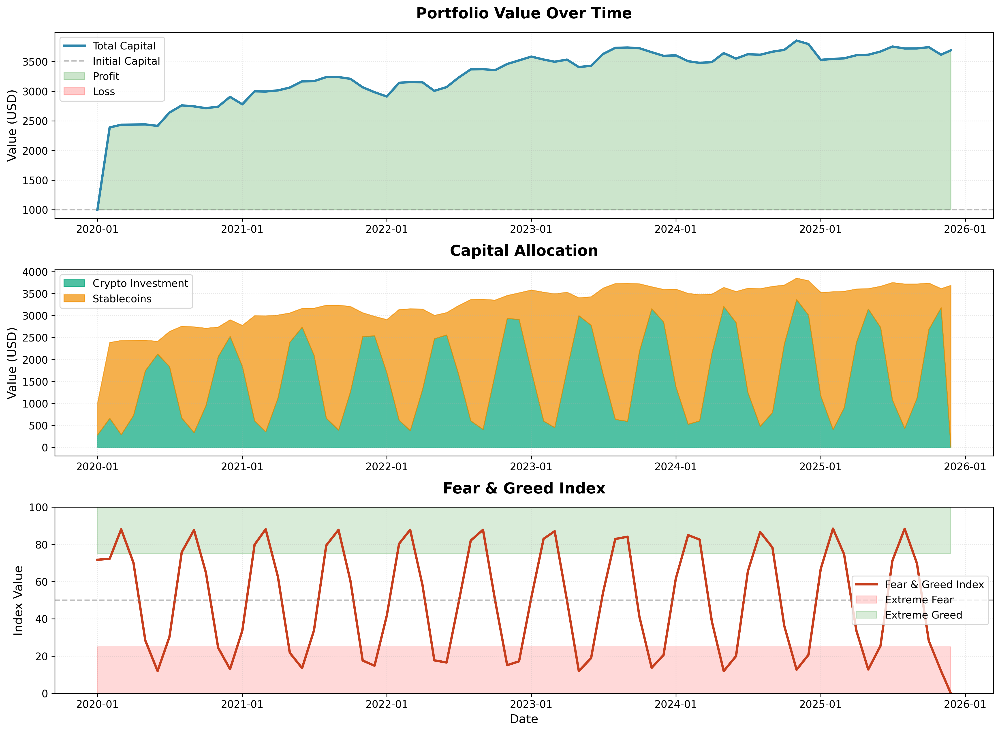

# Crypto Portfolio Strategy - Fear & Greed Index Based

## 📊 Стратегия

Исследование и тестирование криптовалютной портфельной стратегии на основе индекса страха и жадности (Fear & Greed Index).

### Основные принципы

1. **Ежемесячная ребалансировка** - портфель пересобирается в начале каждого месяца
2. **ТОП-20 криптовалют** - инвестируем только в крупнейшие криптовалюты (исключая стабилкоины)
3. **Равномерное распределение** - по 5% на каждую монету (20 монет × 5% = 100%)
4. **Динамический капитал** - размер инвестирования зависит от индекса страха и жадности

### Формула расчета капитала

```
Капитал для инвестирования = ОБЩИЙ_КАПИТАЛ × (1 - Индекс_страха_и_жадности)
Капитал в стабилкоинах = ОБЩИЙ_КАПИТАЛ - Капитал_для_инвестирования
```

**Индекс страха и жадности** берется как **среднее значение за предыдущий месяц** в диапазоне 0-1:
- 0 = Extreme Fear (максимальные инвестиции)
- 1 = Extreme Greed (минимальные инвестиции)

### Пример

При капитале **$1,000** и индексе страха **30%** (0.3):
- Капитал для инвестирования: $1,000 × (1 - 0.3) = **$700**
- На каждую из 20 монет: $700 ÷ 20 = **$35**
- В стабилкоинах: **$300**

При следующей ребалансировке пересчитывается стоимость всех активов и формула применяется заново.

## 📈 Результаты бэктестинга

**Период:** 2020-01-01 до 2025-11-25 (71 месяц, ~6 лет)

### Основные показатели

| Метрика | Значение |
|---------|----------|
| 💰 Начальный капитал | $1,000.00 |
| 💵 Конечный капитал | $3,689.71 |
| 📈 Общая доходность | **+268.97%** |
| 💵 Абсолютная прибыль | **+$2,689.71** |
| 📊 Годовая доходность | **24.31%** |

### Статистика

| Метрика | Значение |
|---------|----------|
| Средняя доходность за ребалансировку | 2.61% |
| Волатильность | 16.67% |
| Максимальная просадка | -10.14% |
| Лучший период | +138.91% |
| Худший период | -7.02% |
| Sharpe Ratio | 0.54 |

### Визуализация



График показывает:
1. **Рост стоимости портфеля** - стабильный рост с $1,000 до $3,689
2. **Распределение капитала** - динамическое изменение между криптовалютами и стабилкоинами
3. **Индекс страха и жадности** - циклические колебания, влияющие на размер инвестиций

## 🔧 Технические детали

### Структура проекта

```
.
├── README.md                      # Документация
├── requirements.txt               # Python зависимости
├── crypto_strategy_demo.py        # Основной скрипт бэктестинга
├── crypto_strategy_backtest.py    # Версия с реальными API
├── backtest_results.png           # График результатов
└── backtest_data.csv              # Данные бэктеста
```

### Установка

```bash
pip install -r requirements.txt
```

### Запуск

```bash
# Демонстрационная версия с синтетическими данными
python3 crypto_strategy_demo.py

# Версия с реальными API (требует доступ к API)
python3 crypto_strategy_backtest.py
```

## 📊 Данные

### Источники данных (для реальной версии)

- **Индекс страха и жадности:** [Alternative.me API](https://alternative.me/crypto/fear-and-greed-index/)
- **Цены криптовалют:** [CoinGecko API](https://www.coingecko.com/en/api)

### ТОП-20 криптовалют (примерный список)

BTC, ETH, BNB, XRP, ADA, DOGE, SOL, TRX, DOT, MATIC, LTC, SHIB, AVAX, UNI, LINK, XLM, ATOM, XMR, BCH, ALGO

*Список может меняться в зависимости от текущей рыночной капитализации*

## 💡 Ключевые наблюдения

### Преимущества стратегии

1. **Защита от жадности** - при высоком индексе (жадность) стратегия держит больше в стабилкоинах
2. **Возможность покупать на страхе** - при низком индексе (страх) увеличивается инвестиционный капитал
3. **Диверсификация** - распределение по 20 крупнейшим криптовалютам снижает риски
4. **Дисциплина** - автоматическая ребалансировка предотвращает эмоциональные решения

### Ограничения

1. **Комиссии не учтены** - в реальности торговые комиссии снизят доходность
2. **Проскальзывание** - при больших объемах цена исполнения может отличаться
3. **Налоги** - не учтены налоговые последствия частых ребалансировок
4. **Исторические данные** - прошлая доходность не гарантирует будущих результатов

## ⚠️ Disclaimer

Этот проект создан исключительно в **образовательных целях**. Не является финансовой рекомендацией. Всегда проводите собственное исследование (DYOR) перед принятием инвестиционных решений.

Криптовалютные инвестиции сопряжены с высокими рисками, включая возможность полной потери капитала.

## 📝 Лицензия

MIT License

---

**Создано:** 2025-11-25
**Версия:** 1.0
